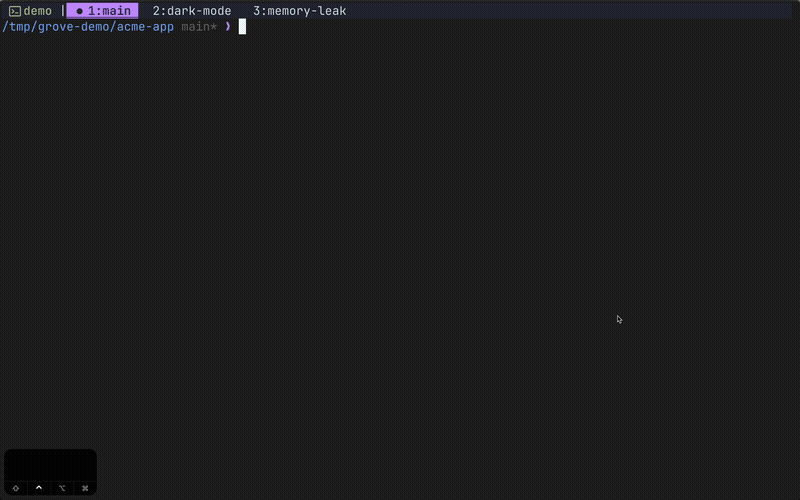

# grove

A terminal UI for managing Git worktrees.



## Installation

Brew installation:

```bash
brew install henri123lemoine/tap/grove
```

See [docs/installation.md](./docs/installation.md) for more options and details.

## Usage

```bash
grove
```

Press ? for keybindings.

## Configuration

Config location: `~/.config/grove/config.toml`. See [docs/configuration.md](./docs/configuration.md) for all options and examples.

## Integration

This tool is meant to integrate with terminal multiplexers like tmux and zellij. See [docs/integrations.md](./docs/integrations.md) for integration information.

## License

MIT
