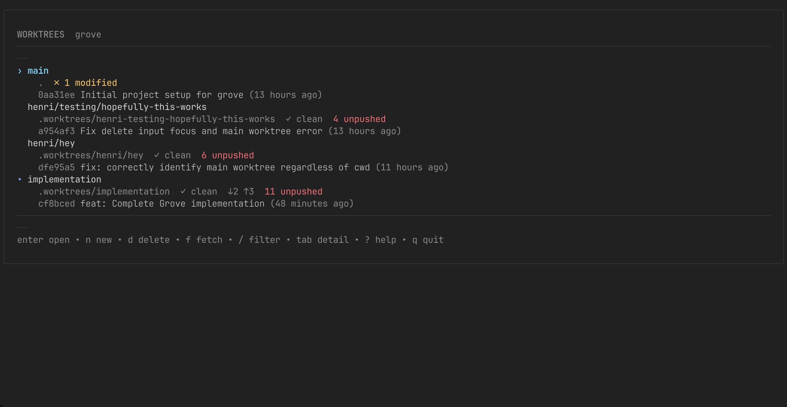

# grove

A terminal UI for managing Git worktrees.



## Features

- **List worktrees** with status indicators (dirty/clean, ahead/behind, merged)
- **Create worktrees** from existing or new branches
- **Delete safely** with smart warnings about uncommitted changes and unique commits
- **Open anywhere** - configurable for tmux, zellij, VS Code, or any command
- **Fuzzy filter** to quickly find worktrees
- **Detail panel** for expanded worktree information

## Installation

```bash
go install github.com/henrilemoine/grove/cmd/grove@latest
```

## Quick Start

```bash
# Run in any git repository
grove
```

## Keybindings

| Key | Action |
|-----|--------|
| `↑/k` `↓/j` | Navigate |
| `enter` | Open worktree |
| `n` | New worktree |
| `d` | Delete worktree |
| `p` | Create pull request |
| `r` | Rename branch |
| `s` | Manage stashes |
| `P` | Prune stale worktrees |
| `f` | Fetch all remotes |
| `/` | Filter worktrees |
| `tab` | Toggle detail panel |
| `?` | Show help |
| `q` | Quit |

## Configuration

Config location: `~/.config/grove/config.toml`

```toml
[open]
# Command to run when opening a worktree
# Variables: {path}, {branch}, {branch_short}, {repo}
command = "tmux select-window -t :{branch_short} 2>/dev/null || tmux new-window -n {branch_short} -c {path}"
exit_after_open = true

[general]
worktree_dir = ".worktrees"
```

See [docs/configuration.md](./docs/configuration.md) for all options and examples.

## tmux Integration

Add to `~/.tmux.conf`:

```bash
bind-key w display-popup -E -w 80% -h 80% "grove"
```

See [docs/integrations.md](./docs/integrations.md) for zellij, VS Code, and more.

## Documentation

- [Installation](./docs/installation.md)
- [Configuration](./docs/configuration.md)
- [Integrations](./docs/integrations.md)

## License

MIT
